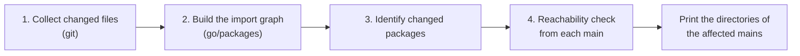
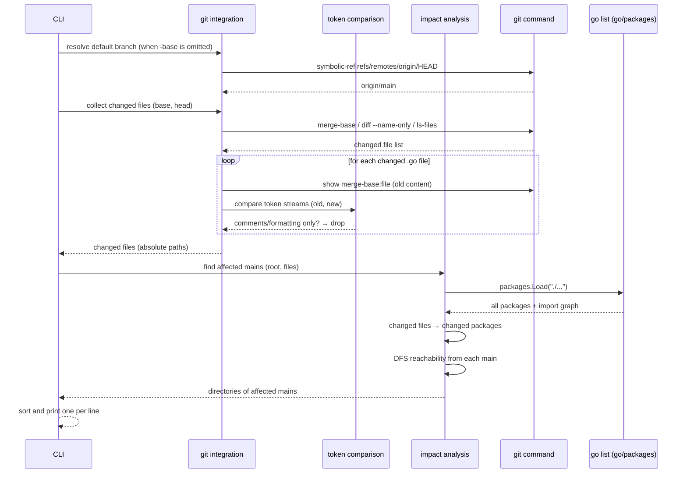
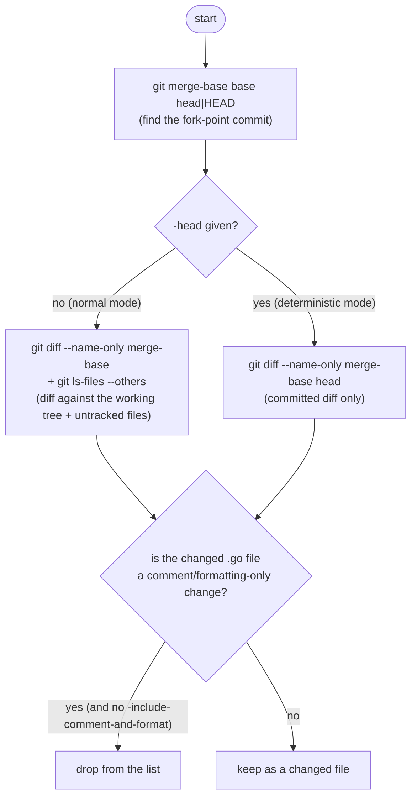
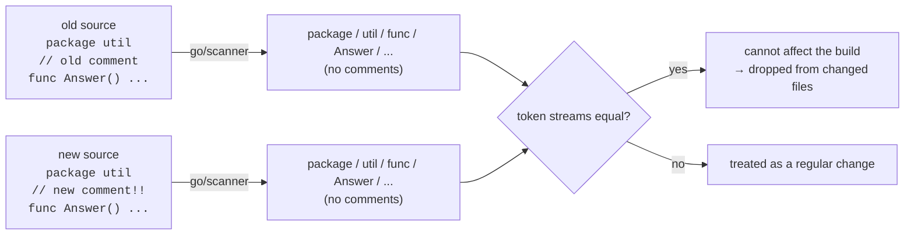
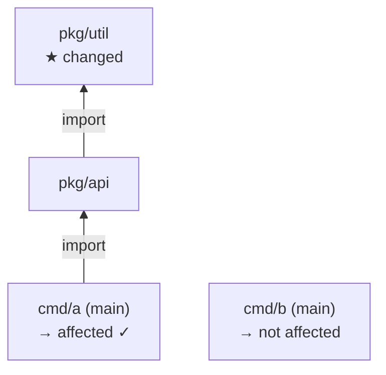

# How goaffected works

goaffected answers the question "which main packages (binaries) does a set
of changed Go-related files affect?". The processing consists of four
stages.

The guiding principle: **ask git "what changed" and ask the Go toolchain
(`go list`) "what depends on what"**. Imports are never guessed by hand, so
build tags, `//go:embed`, and similar behaviors match the compiler exactly.

## Overall flow

## 1. Collecting changed files

The changed file list is assembled from a few git commands.

- The comparison always starts at the **merge-base** (the fork point of
  `-base` and HEAD/`-head`). On a feature branch this means "every change
  since branching off the default branch".
- When `-base` is omitted, the default branch that `origin/HEAD` points at
  is used (an error if it is not set).
- With `-head`, only the diff between the two commits is considered, so the
  same two commits always produce the same result (deterministic mode for
  CI).
- Renamed files are listed as a deletion plus an addition (`--no-renames`),
  so the package that lost the file counts as changed too. Paths are read
  NUL-separated (`-z`), so non-ASCII filenames come back unquoted.
- Files the go tool ignores (under `testdata` or directories starting with
  `.`/`_`) are dropped here, including go.mod / go.sum fixtures.

## Detecting comment/formatting-only changes

The old source (`git show merge-base:file`) and the new source are broken
into **token streams** with `go/scanner` and compared.

Comments are not part of the token stream, so differences in comments,
blank lines, and indentation vanish automatically. If the token stream the
compiler reads is identical, the produced binary is identical too.

To stay safe, the following cases count as changed:

| Case | Reason |
|---|---|
| Directives such as `//go:build` `//go:embed` `//line` `//export` | Comments, but they affect the build, so they stay in the compared stream |
| Files using cgo (`import "C"`) | The C preamble lives in comments, so these always count as changed |
| Unparsable or deleted files | Anything undecidable counts as changed |

## 2. Building the import graph

`packages.Load(cfg, "./...")` from `golang.org/x/tools/go/packages` loads
every package in the module. It runs `go list` under the hood and yields
each package's source files, embedded files, and imports. Two indexes are
built alongside:

- file path → package (to match `.go` and embedded files)
- directory → package (to match deleted files)

## 3. Changed files → changed packages

The changed files from stage 1 are matched against the indexes from stage 2
to form the set of "changed packages".

| Changed file | Handling |
|---|---|
| Regular `.go` | Its package counts as changed |
| Deleted `.go` (not in the index) | The package in the same directory counts as changed |
| File embedded via `//go:embed` | The embedding package counts as changed |
| `_test.go` | Ignored; does not affect binaries |
| `go.mod` | Old and new contents are diffed; **packages of the modules whose requirements changed** count as changed (see below) |
| `go.sum` | Added/removed entries are ignored; a changed hash for the same version marks that module (see below) |
| `go.work` | Affected modules are derived from the use / replace diff (like go.mod). Adding/removing the file is also analyzed per member. `go`/`toolchain` changes affect all mains |
| `go.work.sum` | Same as go.sum (added/removed entries ignored, a changed hash for the same version marks that module) |
| Files under `testdata` or directories starting with `.`/`_` | Ignored; the go tool ignores them |
| Anything else (README, etc.) | Ignored |

### Handling go.mod / go.sum changes

A go.mod change does not mean "everything is affected". The old
(merge-base) and new contents are each parsed with
`golang.org/x/mod/modfile` and compared to extract **the paths of modules
whose require / replace entries changed**. Packages belonging to those
modules become "changed packages", and only the mains that transitively
import them are affected. In other words, bumping a library's version does
not trigger rebuilds of mains that never use that library.

Diffs produced by `go mod tidy` that cannot change the build are not
detected as changes:

- Reordered requires, regrouped blocks, added/removed `// indirect`
  comments → no diff, because the files are parsed and compared as
  path → version sets.
- Removed requires for modules that are no longer used → the module is
  marked, but none of its packages appear in any main's import graph, so
  the reachability check naturally reports "not affected".
- Added or removed `go.sum` entries (pruned or fetched hashes) → ignored.
  With module graph pruning (go 1.17+), the selected version of every
  module used in the build is recorded in go.mod's require directives, so
  a version-selection change always shows up in go.mod. (Only for modules
  whose `go` directive is below 1.17 is every main conservatively treated
  as affected.)

A **changed hash for the same module@version** in go.sum is different: it
means the content behind that version itself changed — e.g. a tag moved to
another commit in a private module (`GOPRIVATE`) that is not verified
against the checksum database — which can change the binary, so that module
counts as changed.

Official references for this reasoning:

> At `go 1.17` or higher: The `go.mod` file includes an explicit `require`
> directive for each module that provides any package transitively imported
> by a package or test in the main module.
>
> — [Go Modules Reference: Module graph pruning](https://go.dev/ref/mod#graph-pruning)

> If a module specifies `go 1.17` or higher in its `go.mod` file, its
> `go.mod` file now contains an explicit `require` directive for every
> module that provides a transitively-imported package.
>
> — [Go 1.17 Release Notes: Pruned module graphs](https://go.dev/doc/go1.17#go-command)

`go.work` follows the same idea. When a member (a `use` directory) joins or
leaves the workspace, only two kinds of modules can see their selected
version change:

1. **The member itself** — import resolution switches between the local
   copy and the published version.
2. **Modules the member's go.mod requires at a higher version than the root
   module does** — the workspace build list is minimal version selection
   over the union of all members' requirements, so these selections can be
   raised by joining and lowered back by leaving. (Modules the root module
   already requires at the same or a higher version cannot change.)

This computation applies not only to added/removed `use` directives but
also to **adding or removing go.work itself**. For example, adding a
go.work that only contains `use .` changes nothing about the build, so
nothing is reported as affected. Replace diffs identify the target module
just like go.mod, and `go.work.sum` follows the go.sum rules.

The following changes do affect the whole build, so every main is treated
as affected:

- a changed `go` / `toolchain` directive (compiler behavior changes)
- a changed module path
- a member go.mod below go 1.17 (its requirements are not fully recorded,
  so the computation above is impossible), or a member outside the
  repository that cannot be resolved

Unparsable go.mod / go.work files are reported as errors.

## 4. Reachability from each main

For each `main` package in the module, the import graph is walked
depth-first (with memoization) to check **whether any "changed package"
appears among its transitive dependencies**.

In this example the change to `pkg/util` reaches `cmd/a` through `pkg/api`,
so only `cmd/a` is printed. Results are memoized per package, so the whole
graph is walked only once.

Finally, the directories of the affected main packages are converted to
paths relative to the module root, sorted, and written to stdout one per
line.

## Limitations

- Single-module repositories are assumed. In a multi-module repository,
  run the tool once per module with `-C`.
- The import graph is read from the currently checked-out sources. When
  using `-head`, run with that commit checked out.
- The analysis is package-granular. Symbol-level reachability (e.g.
  ignoring changes to unused functions) is intentionally unsupported:
  calls through interfaces and init side effects cannot be handled safely.
